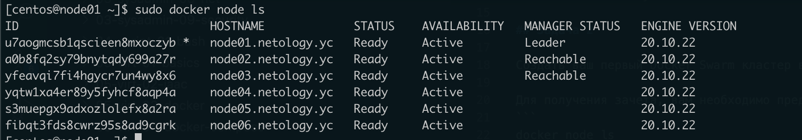
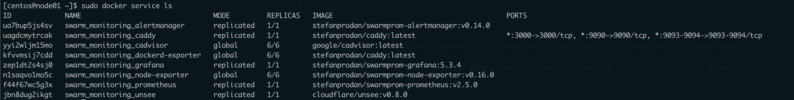

## Задача 1

Дайте письменные ответы на следующие вопросы:

- В чём отличие режимов работы сервисов в Docker Swarm кластере: replication и global?


*в режиме replication запускается заданное количество идентичных задач (реплик).*

*сервис запущенный в режиме global запускает по одной задаче на каждую ноду.*

- Какой алгоритм выбора лидера используется в Docker Swarm кластере?

*В Docker Swarm кластере используется алгоритм поддержания распределенного консенсуса — Raft*

- Что такое Overlay Network?

*Overlay Network— это наложенная сеть, поверх другой сети. в Частности в Docker, это распределенная сеть между Docker-хостами.*


## Задача 2

Создать ваш первый Docker Swarm кластер в Яндекс.Облаке

Для получения зачета, вам необходимо предоставить скриншот из терминала (консоли), с выводом команды:
```
docker node ls
```

<p align="center">
  
</p>

## Задача 3

Создать ваш первый, готовый к боевой эксплуатации кластер мониторинга, состоящий из стека микросервисов.

Для получения зачета, вам необходимо предоставить скриншот из терминала (консоли), с выводом команды:
```
docker service ls
```

<p align="center">
  
</p>

